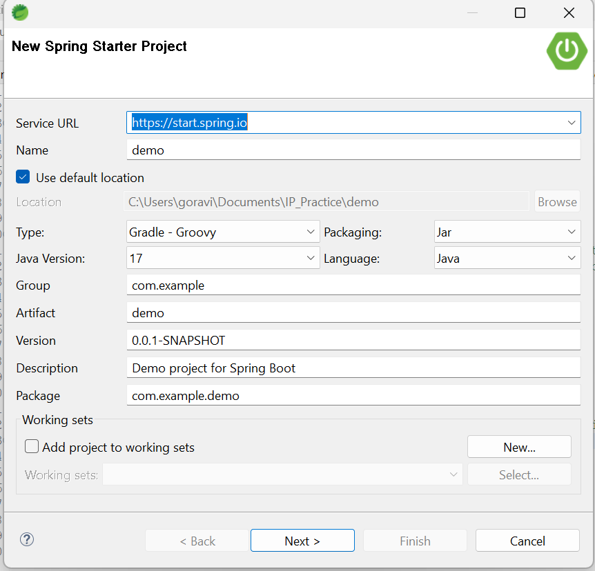
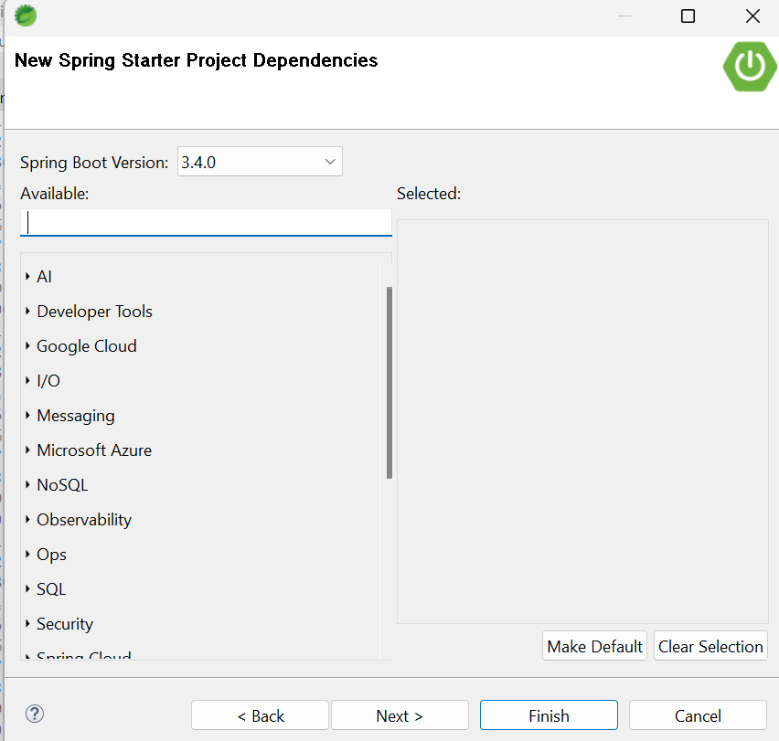
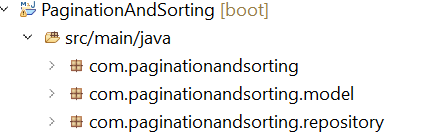
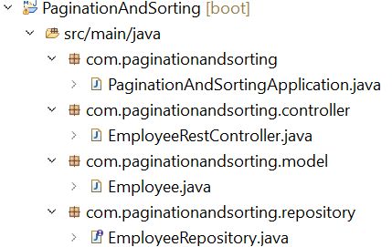
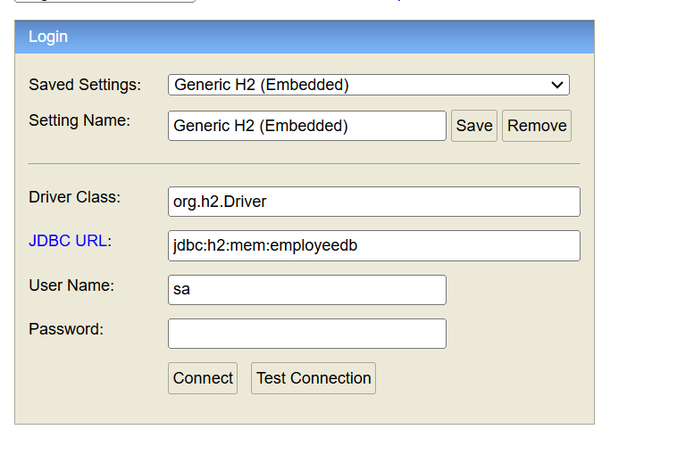
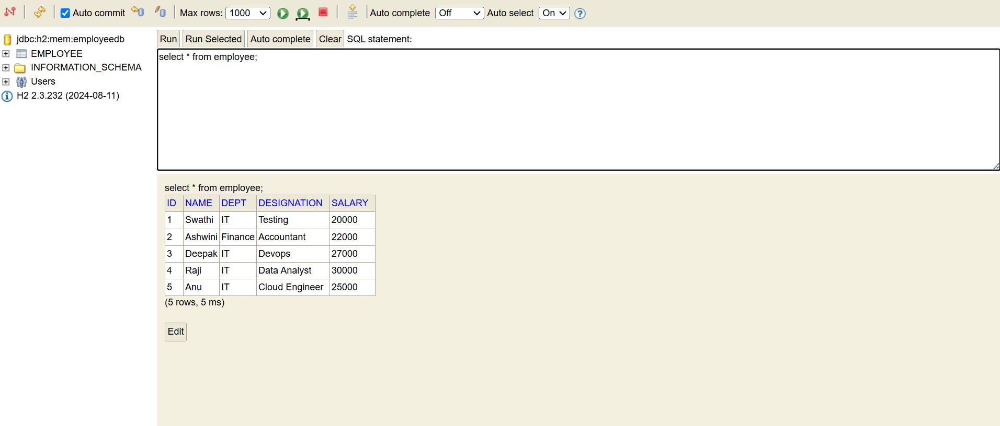

# Pagination And Sorting Application

## To clone this application using git

```
Try this if you are familiar with git, otherwise follow the below approach to create the project

git clone https://github.com/GomathiRavi17/PaginationAndSorting.git

Vist https://github.com/GomathiRavi17/PaginationAndSorting
Click <> code -> download zip. This option allows us to download the project as zip file
Extract the project and import as maven project in spring tool suite
```

## Steps to create a Springboot Application

```
1. Install Spring tool suite, latest version of jdk
2. Click File -> new -> spring starter project
3. Open the Spring tool suite ide, click on new option to create a new springboot project
4. After clicking on the new project, you will get a pop up to enter package name and artifact-id
5. Artifact Id is the project name and package name should be like com.example (package name should always start with com.)
```



```
6. Select the location where your project should be saved
7. Group and package are same
8. Click on next, after providing the above mentionioned details
```



```
9. select the following dependencies: Spring web, Spring data jpa, h2 database, lombok and click on finish.
10. Now the Spring boot project is created with the specified dependencies
11. Navigate to /src/main/java folder
12. Java main class will available in the package which we specified
13. create additional packages from root package (com.example) for model, controller and repository classes
14. packages are created to group similar kind of classes
15. packages for model, controller and repo will look like
```



```
16. create model class and repository interface in the respective packages
```



```
17. follow the comments in each classes to know more about it
18. If you didn't specify the port numbe in application.properties file, then it will take the default one which is 8080
19. h2 is embedded database which is a part of the spring application. data will be persisted only till the application is running
```

```
Add these properties in application.properties in /src/main/resource folder

spring.application.name=PaginationAndSorting
#Port Number (optional)
server.port=8085

# H2 Database Configuration
spring.datasource.url=jdbc:h2:mem:employeedb
spring.datasource.driverClassName=org.h2.Driver
spring.datasource.username=sa
spring.datasource.password=
spring.jpa.database-platform=org.hibernate.dialect.H2Dialect
spring.h2.console.enabled=true
spring.jpa.show-sql=true
spring.jpa.hibernate.ddl-auto=update
spring.datasource.data=classpath:data.sql 
```

```
Create data.sql file with the following sql statements in /src/main/resources

this sql file will be recognized by spring boot during application startup and executes the query in this

CREATE TABLE employee (
    id INT PRIMARY KEY,
    name VARCHAR(30),
    dept VARCHAR(64),
    designation VARCHAR(64),
    salary INT
);

INSERT INTO employee VALUES (1, 'Swathi', 'IT', 'Testing', 20000);
INSERT INTO employee VALUES (2, 'Ashwini', 'Finance', 'Accountant', 22000);
INSERT INTO employee VALUES (3, 'Deepak', 'IT', 'Devops', 27000);
INSERT INTO employee VALUES (4, 'Raji', 'IT', 'Data Analyst', 30000);
INSERT INTO employee VALUES (5, 'Anu', 'IT', 'Cloud Engineer', 25000);
```

### To Run the application
```
navigate to PaginationAndSortingApplication.java and right click

click runas -> springboot app

Started PaginationAndSortingApplication in 5.534 seconds (process running for 6.816)

If you get the above log, then you application is running successfully
```

### Steps to check the data in h2 db
```
1. Open any browser
2. type http://localhost:8085/h2-console
3. give jdbc url as: 'jdbc:h2:mem:employeedb', no password
4. click connect
```


```
After clicking on connect, you can see the table like this

execute: select * from employee
```



### Steps to test the api ###

```
1. Open Google Chrome or any Browser
2. type http://localhost:8080/employees
3. this will return the result with pagination
```

### Output ###

```
http://localhost:8085/employees?pageNumber=0&pageSize=3&sortBy=name

/employees -> this is the url to get employees which supports searching for specific employee and pagination

?pageNumber=0&pageSize=3&sortBy=name -> these are request parameters. ? denotes the starting of request param. to pass multiple request params, we separate each param with &

Syntax: paramName=paramValue

This response contains the first three employee data which is sorted by name

Response:

{
  "content": [
    {
      "id": 5,
      "name": "Anu",
      "dept": "IT",
      "designation": "Cloud Engineer",
      "salary": 25000
    },
    {
      "id": 2,
      "name": "Ashwini",
      "dept": "Finance",
      "designation": "Accountant",
      "salary": 22000
    },
    {
      "id": 3,
      "name": "Deepak",
      "dept": "IT",
      "designation": "Devops",
      "salary": 27000
    }
  ],
  "pageable": {
    "pageNumber": 0,
    "pageSize": 3,
    "sort": {
      "empty": false,
      "sorted": true,
      "unsorted": false
    },
    "offset": 0,
    "paged": true,
    "unpaged": false
  },
  "last": false,
  "totalElements": 5,
  "totalPages": 2,
  "size": 3,
  "number": 0,
  "sort": {
    "empty": false,
    "sorted": true,
    "unsorted": false
  },
  "first": true,
  "numberOfElements": 3,
  "empty": false
}
```


